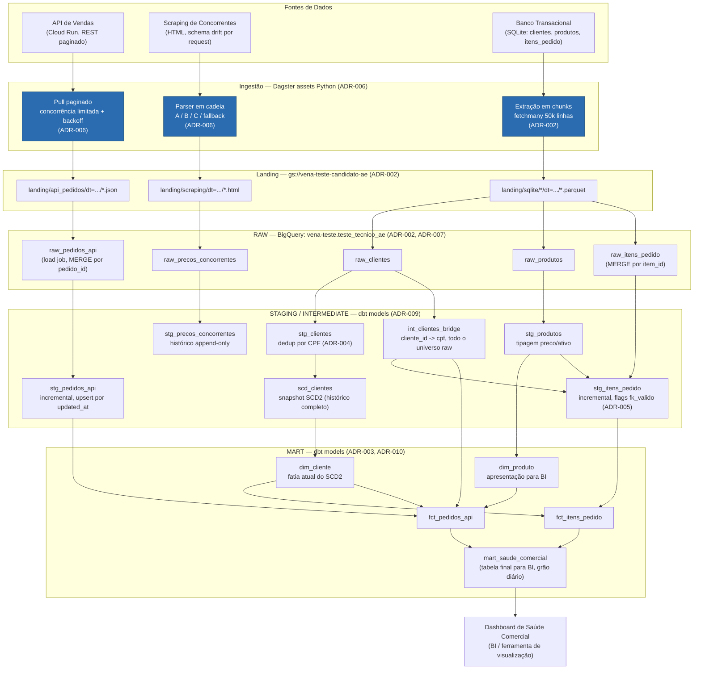

# Diagrama de Fluxo

Diagrama de referência da arquitetura, escrito no Dia 1 (antes de
qualquer implementação) e atualizado no Dia 6 para refletir o que foi de
fato construído entre os Dias 2-5 — as duas divergências reais entre o
plano original e a entrega estão marcadas explicitamente abaixo, não
escondidas.

## Notas de leitura do diagrama

- **Caixa azul (`ING_*`)**: assets Python orquestrados diretamente pelo
  Dagster, com `RetryPolicy` e schedule diário — é onde vive a resiliência
  de ingestão (ADR-006).
- **STAGING/MART**: modelos dbt, orquestrados pelo Dagster via
  `dagster-dbt` (`dagster_project/dbt_assets.py`, ADR-001) — cada caixa é
  um asset dbt real no grafo (confirmado via
  `resolve_asset_graph()`), não um script solto.
- **`F_API` e `F_ITENS` não se unem em uma tabela de fatos única** — são
  ramos paralelos até `mart_saude_comercial`, que os agrega lado a lado
  (ADR-003). Essa é a decisão de design mais visível do diagrama e a que
  mais precisa ser explicada na apresentação técnica.
- **`scd_clientes` (snapshot) e `dim_cliente` (fatia atual) são dois
  modelos, não um** — o snapshot guarda o histórico tipo 2 completo por
  CPF; `dim_cliente` é só a versão vigente (`dbt_valid_to is null`), que é
  o que os fatos de fato consomem. `int_clientes_bridge` é um terceiro
  modelo, separado dos dois: mapeia *todo* `cliente_id` que já existiu no
  cadastro (não só os sobreviventes do dedup) para o `cpf` correspondente
  — é o que evita que um `cliente_id` "perdedor" do dedup vire FK inválida
  por engano (ADR-005/ADR-009).
- Não há seta de `RAW` de volta para as fontes — landing no GCS é o único
  ponto de reprocessamento; a API/scraping não precisam ser consultados de
  novo para reconstruir `staging`/`mart`.

## Divergências entre este diagrama (Dia 1) e a entrega final (Dia 5)

Documentadas aqui em vez de corrigidas silenciosamente:

- **Não existe `mart_precos_competitividade`.** O diagrama original do
  Dia 1 previa um segundo mart comparando preços próprios vs.
  concorrentes. O enunciado pede uma tabela final para BI
  (`mart_saude_comercial`, entregue) — um mart de competitividade de
  preços era ambição extra, não requisito obrigatório, e ficou de fora
  por decisão de escopo/tempo. `stg_precos_concorrentes` existe e está
  testado, mas termina na staging: os dados de cotação de concorrentes
  estão disponíveis para um mart futuro, só não foram agregados nesta
  entrega.
- **`dim_clientes_scd2` virou dois modelos** (`scd_clientes` +
  `dim_cliente`), não um só — ver nota acima.

## O que foi entregue (Dias 2-5, todo validado contra serviços/dados reais)

- Ingestão resiliente das 3 fontes (retry/backoff, cooldown compartilhado,
  parser em cadeia com fallback) — `ingestion/`.
- Orquestração Dagster completa: 5 assets raw + grafo dbt integrado via
  `dagster-dbt`, `daily_raw_job`/`scraping_job`, `daily_schedule` (cron
  diário), `scraping_failure_alert` (`run_failure_sensor`), `RetryPolicy`
  no asset de scraping — `dagster_project/`.
- Staging com dedup, tipagem defensiva e SCD2 real (`dbt snapshot`) —
  `dbt/models/staging/`, `dbt/snapshots/`.
- Mart com dimensões, fatos e a tabela final de BI, mais prova formal de
  idempotência (`COUNT`+checksum idênticos em duas execuções seguidas) —
  `dbt/models/marts/`, ADR-010.
- 27 testes dbt + 21 testes pytest, todos passando no momento deste
  commit.
