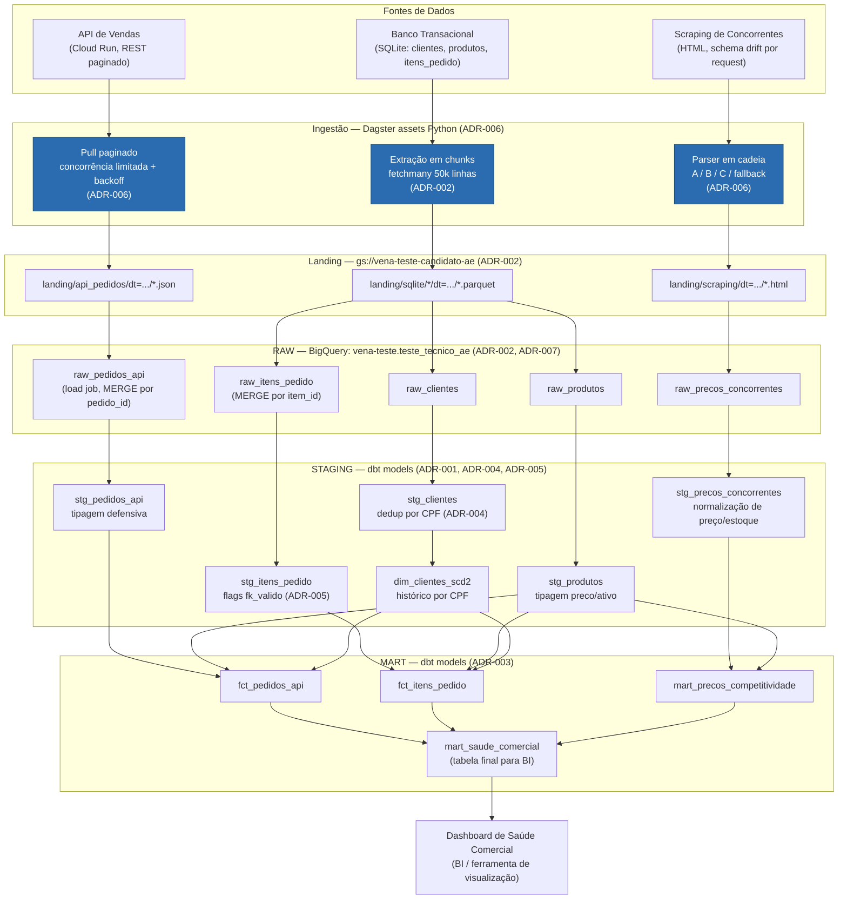

# Diagrama de Fluxo — Dia 1

Diagrama de referência da arquitetura decidida nas ADRs. Ele é a versão
"alto nível" — o grafo de assets do Dagster propriamente dito (com nomes
exatos de cada asset, schedule, sensor e retry policy) será detalhado no
Dia 3, quando a orquestração for implementada.

## Notas de leitura do diagrama

- **Caixa azul (`ING_*`)**: assets Python orquestrados diretamente pelo
  Dagster, com `RetryPolicy` e schedule diário — é onde vive a resiliência
  de ingestão (ADR-006).
- **STAGING/MART**: modelos dbt, orquestrados pelo Dagster via
  `dagster-dbt` (ADR-001) — cada caixa é um asset dbt no grafo, não um
  script solto.
- **`F_API` e `F_ITENS` não se unem em uma tabela de fatos única** — são
  ramos paralelos até `mart_saude_comercial`, que os agrega lado a lado
  (ADR-003). Essa é a decisão de design mais visível do diagrama e a que
  mais precisa ser explicada na apresentação técnica.
- **`dim_clientes_scd2` alimenta os dois fatos** — é a dimensão
  compartilhada, deduplicada por CPF (ADR-004), com histórico tipo 2.
- Não há seta de `RAW` de volta para as fontes — landing no GCS é o único
  ponto de reprocessamento; a API/scraping não precisam ser consultados de
  novo para reconstruir `staging`/`mart`.

## O que falta neste diagrama (propositalmente, é o escopo do Dia 3)

- Nome exato de cada schedule/sensor do Dagster.
- Onde entra o `RetryPolicy` e o `run_failure_sensor` (asset de scraping).
- Os asset checks customizados (taxa de fallback do parser, taxa de FK
  inválida, prova de idempotência) — vão aparecer como nós de check
  anexados aos assets correspondentes, não como caixas de dados.
